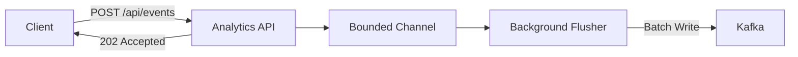

# Analytics Service

> High-throughput clickstream event sink with in-memory channel buffering and Kafka batch flush for zero-loss ingestion.

## High-Level Design

## Features

- Clickstream event ingestion with fire-and-forget semantics
- In-memory bounded channel buffer for backpressure management
- Kafka batch flush for high-throughput delivery
- 202 Accepted response pattern (immediate acknowledgment)
- No database dependency (pure event sink)

## API Endpoints

| Method | Path | Auth | Description |
|--------|------|------|-------------|
| POST | /api/events | Yes | Ingest clickstream event (returns 202 Accepted) |

## Events (Published)

| Event | Destination |
|-------|-------------|
| ClickstreamEvent (raw) | Kafka topic |

## Edge Cases & Hard Problems Solved

- Bounded channel provides backpressure: producers block when channel is full rather than dropping events
- Kafka flush uses configurable batch size and linger for throughput optimization
- No DB means no migration concerns, no connection pool exhaustion, no write amplification
- Service graceful shutdown drains channel before terminating

## Non-Functional Requirements

| Requirement | How Achieved |
|-------------|--------------|
| Sub-ms ingestion latency | Channel write (no I/O in request path) |
| High throughput | Kafka batch flush (amortized network cost) |
| Zero data loss | Bounded channel with wait (never drops) |
| Backpressure | Channel capacity limit prevents OOM |
| Graceful shutdown | Channel drain on application stop |
