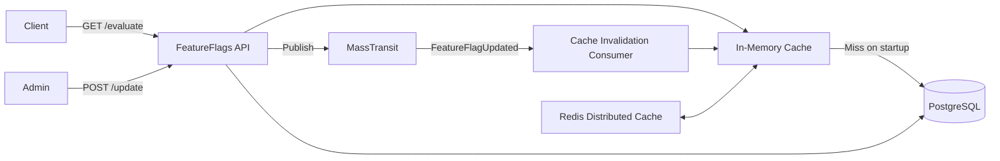
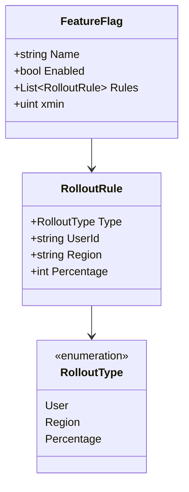

# Feature Flags Service

> Zero-database-hit feature flag evaluation with in-memory cache, Redis distributed sync, and per-user/region/percentage rollout rules.

## High-Level Design

## Features

- Feature flag evaluation with zero DB hits after warmup
- Per-user, per-region, and percentage-based rollout rules
- In-memory cache warmed at startup from database
- Redis distributed cache for cross-instance synchronization
- MassTransit consumer for real-time cache invalidation
- Immutability guard: cannot delete an enabled flag
- Maximum 20 rules per flag

## API Endpoints

| Method | Path | Auth | Description |
|--------|------|------|-------------|
| GET | /api/featureflags/evaluate?flagName=&region= | Yes | Evaluate a feature flag |
| POST | /api/featureflags/update | Admin | Create or update a feature flag |
| DELETE | /api/featureflags/{flagName} | Admin | Delete a disabled feature flag |

## Events (Published / Consumed)

**Published:**

| Event | Trigger |
|-------|---------|
| FeatureFlagUpdated | Flag created or updated |

**Consumed:**

| Event | Effect |
|-------|--------|
| FeatureFlagUpdated | Re-hydrate in-memory cache from DB |

## Domain Model

## Edge Cases & Hard Problems Solved

- Fail-open on startup: service starts successfully even if cache warmup fails (serves stale/empty until next sync)
- Maximum 20 rules per flag prevents unbounded memory growth
- Cannot delete an enabled flag (must disable first) prevents accidental feature removal in production
- xmin-based optimistic concurrency prevents lost updates on concurrent edits

## Non-Functional Requirements

| Requirement | How Achieved |
|-------------|--------------|
| Sub-ms evaluation | In-memory dictionary lookup |
| Cross-instance consistency | Redis distributed cache + MassTransit event |
| Zero-downtime deploys | Cache warmup on startup, fail-open |
| Concurrency safety | PostgreSQL xmin optimistic concurrency |
| Bounded memory | Max 20 rules per flag |
