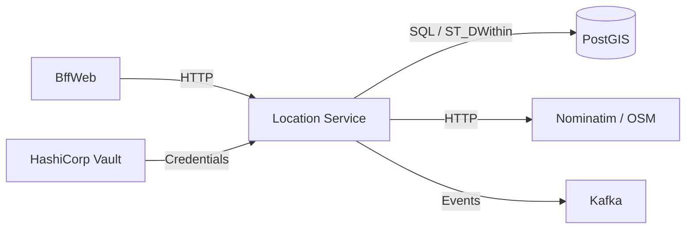

# Location Service

> Geospatial address management with PostGIS spatial queries, Nominatim geocoding, and Vault-backed credential rotation.

## High-Level Design



## Features

- Geospatial address management powered by PostGIS and NetTopologySuite
- Geocoding via Nominatim (OpenStreetMap) with fallback strategies
- Geohash computation at level 12 for range query optimization
- Spatial proximity search using ST_DWithin
- Vault-backed database credentials with automatic rotation
- Outbox-guaranteed event publishing

## API Endpoints

| Method | Path | Auth | Description |
|--------|------|------|-------------|
| POST | /api/addresses | Yes | Create address with optional geocoding |
| GET | /api/addresses/nearby?lat=&lon=&radiusMeters=&limit= | Yes | Find addresses within radius |

## Events

### Published

| Event | Payload | Trigger |
|-------|---------|---------|
| LocationUpdated | LocationId, address, lat, lon, geohash | Address created or geocoded |

## Domain Model

```
Address
├── Id : Guid
├── Street, City, State, PostalCode, Country
├── Location : Point (SRID 4326, WGS84)
├── Geohash : string (level 12)
└── CreatedAt / UpdatedAt
```

## Edge Cases & Hard Problems Solved

- Geocoding fallback: if full-address geocoding fails, retries with postcode-only to maximize hit rate
- Geohash pre-computation at level 12 enables efficient range-prefix queries without runtime computation
- WGS84 SRID 4326 enforced consistently across all spatial operations — prevents silent coordinate mismatch
- Vault credential rotation for PostGIS connection strings without service restart

## Non-Functional Requirements

| Requirement | How Achieved |
|-------------|--------------|
| Sub-50ms spatial queries | PostGIS GiST indexes on geometry columns |
| External geocoding isolation | Dedicated HTTP client with timeout and circuit breaker |
| Guaranteed event delivery | Transactional outbox pattern |
| Credential security | Vault dynamic secrets with automatic rotation |
| Data consistency | SRID 4326 enforced at schema level |
