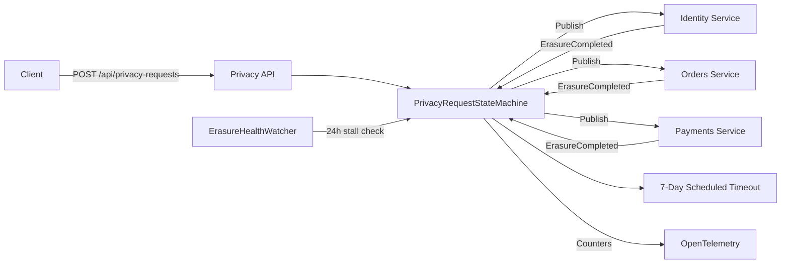
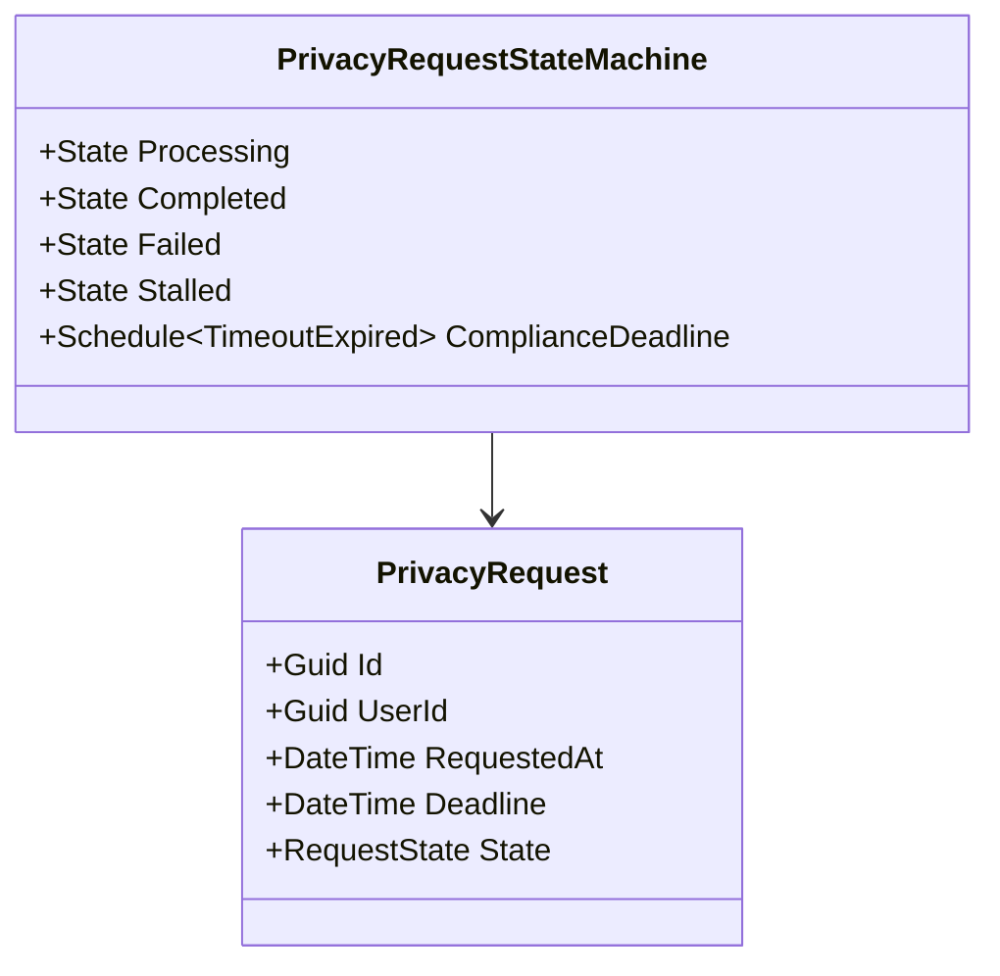

# Privacy Service

> GDPR erasure orchestration engine that coordinates multi-service data deletion within a guaranteed 7-day compliance window.

## High-Level Design

## Features

- GDPR Article 17 erasure orchestration via MassTransit saga
- 7-day compliance deadline enforced by scheduled timeout
- Multi-service coordination (identity, orders, payments)
- ErasureHealthWatcher background service for stalled request alerts
- OpenTelemetry compliance counters for monitoring and audit
- Full audit trail of every state transition

## API Endpoints

| Method | Path | Auth | Description |
|--------|------|------|-------------|
| POST | /api/privacy-requests | Yes (rate-limited) | Submit a new erasure request |
| GET | /api/privacy-requests/{id} | Yes | Query erasure request status |

## Events (Published / Consumed)

**Published:**

| Event | Trigger |
|-------|---------|
| EraseIdentityDataCommand | Request enters Processing |
| EraseOrderDataCommand | Request enters Processing |
| ErasePaymentDataCommand | Request enters Processing |

**Consumed:**

| Event | Effect |
|-------|--------|
| ErasureCompleted (Identity) | Mark identity leg complete |
| ErasureCompleted (Orders) | Mark orders leg complete |
| ErasureCompleted (Payments) | Mark payments leg complete |

## Domain Model

## Edge Cases & Hard Problems Solved

- Late-arriving ErasureCompleted events are deduplicated (idempotent consume)
- 24-hour stall detection via ErasureHealthWatcher raises alerts before deadline
- 7-day scheduled timeout forces saga to Failed state, ensuring no request is silently lost
- GDPR Article 17 compliance monitoring via OTel counters (requests_total, requests_completed, requests_failed, requests_stalled)

## Non-Functional Requirements

| Requirement | How Achieved |
|-------------|--------------|
| Guaranteed completion within 7 days | MassTransit scheduled timeout |
| Multi-service coordination | Saga state machine with per-service tracking |
| Audit trail | Every state transition persisted with timestamp |
| Observability | OTel compliance counters + structured logging |
| Reliability | Outbox pattern for event delivery |
