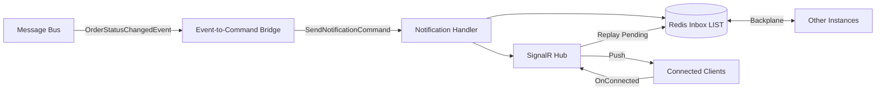

# Realtime Service

> SignalR push notification hub with Redis inbox persistence, at-least-once delivery, and multi-instance scale-out via Redis backplane.

## High-Level Design

## Features

- SignalR push notifications to connected clients
- Redis inbox (LIST) for at-least-once delivery persistence
- Redis backplane for multi-instance scale-out
- Event-to-command bridge (OrderStatusChanged to push notification)
- Pending message replay on client reconnect
- Get-Send-Acknowledge atomic message delivery pattern

## Hub

| Path | Auth | Description |
|------|------|-------------|
| /hubs/notifications | Yes | Notification hub; OnConnectedAsync flushes pending messages |

## Events (Consumed)

| Event | Effect |
|-------|--------|
| OrderStatusChangedEvent | Converted to SendNotificationCommand, pushed to user |

## Edge Cases & Hard Problems Solved

- Get-Send-Acknowledge pattern: message is fetched from Redis, sent via SignalR, then acknowledged (removed) only after successful delivery
- Late-arriving messages (sent while user offline) are stored in Redis LIST and replayed on next OnConnectedAsync
- Redis LIST provides durability: messages survive service restarts
- Redis backplane ensures a message reaches the correct instance regardless of which node the user is connected to

## Non-Functional Requirements

| Requirement | How Achieved |
|-------------|--------------|
| Sub-100ms push latency | SignalR WebSocket direct push |
| Multi-instance scale-out | Redis backplane |
| At-least-once delivery | Redis inbox persistence + replay on reconnect |
| Message durability | Redis LIST survives service restarts |
| Graceful degradation | Messages queue in Redis if user is offline |
