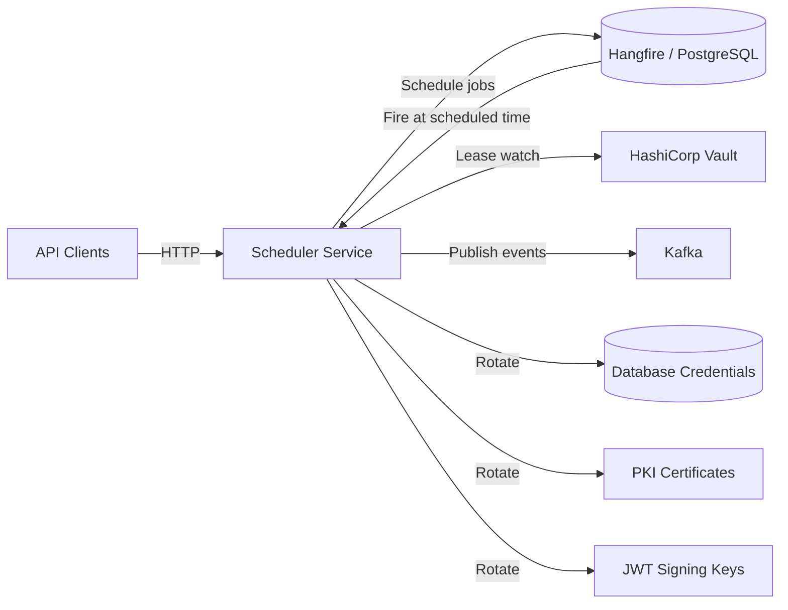

# Scheduler Service

> Scheduled event publishing with Hangfire, Vault lease monitoring and credential rotation, and JWT key rotation with zero-downtime overlap windows.

## High-Level Design



## Features

- Scheduled event publishing — deliver events at a precise future time via Hangfire
- Vault lease monitoring with automatic rotation at 80% TTL threshold
- JWT key rotation (monthly, RSA-2048) with 15-minute overlap window for zero-downtime
- Database and PKI credential rotation with audit trail
- Idempotent scheduling via deduplication key
- Stale rotation state recovery (auto-reset after 10 minutes)

## API Endpoints

| Method | Path | Auth | Description |
|--------|------|------|-------------|
| POST | /api/scheduling/schedule | Yes | Schedule an event for future delivery |

## Events

### Published

| Event | Trigger | Description |
|-------|---------|-------------|
| CredentialRotatedEvent | Vault lease at 80% TTL | Database credentials rotated |
| CertificateRotatedEvent | Vault PKI lease expiry | TLS certificate rotated |
| RotationFailedEvent | Rotation error | Rotation attempt failed (alerting) |
| JwtKeyRotatedEvent | Monthly schedule | New RSA-2048 signing key active |

### Recurring Jobs

| Job | Schedule | Purpose |
|-----|----------|---------|
| secret-expiry-watcher | Every 15 min | Check Vault secret TTLs, trigger rotation if >= 80% |
| rotate-jwt-key | Monthly | Generate new RSA-2048 key, publish, schedule old-key cleanup |
| vault-lease-watcher | Hourly | Monitor all tracked Vault leases, renew or rotate |

## Domain Model

```
ScheduledEvent
├── Id : Guid
├── IdempotencyKey : string (unique constraint)
├── EventType : string
├── Payload : JSON
├── ScheduledFor : DateTimeOffset
├── Status : Pending | Published | Failed

VaultLease
├── LeaseId : string
├── Path : string (secret path)
├── TTL : TimeSpan
├── IssuedAt : DateTimeOffset
├── State : Active | Rotating | Rotated
├── NeedsRotation() : bool (true at 80% TTL)

RotationAuditEntry
├── Id : Guid
├── SecretPath : string
├── RotationType : Database | PKI | KV | JWT
├── RotatedAt : DateTimeOffset
├── Success : bool
├── ErrorMessage : string?
```

## Edge Cases & Hard Problems Solved

- VaultLease.NeedsRotation() triggers at 80% TTL — provides buffer before expiry without premature rotation
- Stale "Rotating" state auto-resets after 10 minutes — prevents permanently stuck leases if a rotation crashes mid-way
- JWT rotation uses 15-minute overlap: writes new key immediately, schedules removal of previous key 15 minutes later — zero token validation failures during rollover
- ScheduledEvent idempotency key (unique constraint) prevents duplicate scheduling even under at-least-once delivery
- DisableConcurrentExecution on all Hangfire jobs prevents race conditions during credential rotation
- Monthly JWT rotation uses RSA-2048 — balances security strength with validation performance

## Non-Functional Requirements

| Requirement | How Achieved |
|-------------|--------------|
| Zero-downtime credential rotation | Overlap windows (15 min for JWT, TTL buffer for Vault) |
| Exactly-once scheduled delivery | Idempotency key + Hangfire persistent storage |
| GDPR-compliant audit trail | RotationAuditEntry for every rotation attempt |
| Hourly lease monitoring | Hangfire recurring job with configurable cron |
| Crash recovery | Stale state detection and auto-reset after timeout |
| No concurrent mutations | DisableConcurrentExecution on all rotation jobs |
