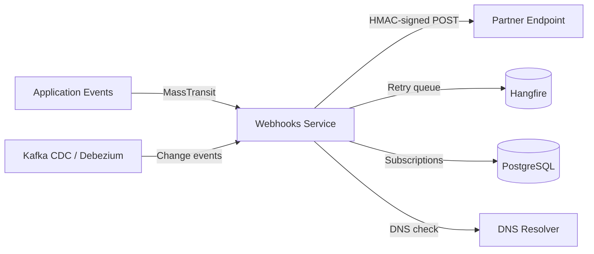

# Webhooks Service

> Webhook subscription management and guaranteed delivery with SSRF prevention, HMAC signing, and dual event sourcing (MassTransit + Kafka CDC).

## High-Level Design



## Features

- Webhook subscription CRUD with partner-scoped isolation
- Guaranteed delivery with Hangfire retry and configurable backoff
- HMAC secret signing with rotation support (bcrypt hash + preview suffix)
- Comprehensive SSRF prevention (blocks private IPs, link-local, DNS rebinding)
- Dual event sources: MassTransit application events + Kafka CDC change streams
- Delivery replay for failed or missed webhooks
- Full delivery attempt audit trail

## API Endpoints

| Method | Path | Auth | Description |
|--------|------|------|-------------|
| POST | /api/webhooks/subscriptions | Yes | Create webhook subscription |
| GET | /api/webhooks/subscriptions/{id} | Yes | Get subscription details |
| PATCH | /api/webhooks/subscriptions/{id} | Yes | Update subscription |
| DELETE | /api/webhooks/subscriptions/{id} | Yes | Delete subscription |
| POST | /api/webhooks/subscriptions/{id}/rotate-secret | Yes | Rotate HMAC signing secret |
| GET | /api/webhooks/deliveries | Yes | List deliveries (filtered) |
| GET | /api/webhooks/deliveries/{id}/attempts | Yes | List delivery attempts |
| POST | /api/webhooks/deliveries/{id}/replay | Yes | Replay a delivery |

## Events

### Consumed

| Event | Source | Description |
|-------|--------|-------------|
| OrderCreatedEvent | MassTransit | New order placed |
| OrderCompletedEvent | MassTransit | Order fulfilled |
| OrderAbandonedEvent | MassTransit | Order abandoned |
| PaymentCompletedEvent | MassTransit | Payment captured |
| RefundIssuedEvent | MassTransit | Refund processed |
| CDC: products | Kafka Debezium | Product data changes |
| CDC: categories | Kafka Debezium | Category data changes |
| CDC: orders | Kafka Debezium | Order state changes |
| CDC: payments | Kafka Debezium | Payment state changes |

## Domain Model

```
Subscription
├── Id : Guid
├── PartnerId : string (from partner_id claim)
├── CallbackUrl : Uri (SSRF-validated)
├── EventTypes : string[] (filter)
├── Secret : bcrypt hash
├── Status : Active | Paused | Disabled

Delivery
├── Id : Guid
├── SubscriptionId : Guid
├── EventType : string
├── Payload : JSON
├── Status : Pending → Delivered | Failed → Exhausted

DeliveryAttempt
├── AttemptNumber : int
├── StatusCode : int
├── ResponseBody : string (truncated)
├── Timestamp : DateTimeOffset
```

## Edge Cases & Hard Problems Solved

- SSRF guard blocks localhost, RFC 1918, link-local (169.254.x.x), CGNAT (100.64.0.0/10), test-nets, multicast, and performs DNS rebinding check via ResolvesToPrivateIpAsync
- Secret rotation uses bcrypt hash with preview suffix — old secret remains valid during rollover window
- Delivery status lifecycle: Pending -> Failed -> Exhausted with configurable exponential backoff
- Duplicate detection via PostgreSQL unique constraint (error code 23505) after crash recovery — prevents double-delivery on restart
- Partner-scoped subscriptions via partner_id JWT claim — tenants cannot access each other's webhooks
- DisableConcurrentExecution on Hangfire jobs prevents parallel delivery to same endpoint

## Non-Functional Requirements

| Requirement | How Achieved |
|-------------|--------------|
| Guaranteed delivery | Hangfire persistent retry with exponential backoff until Exhausted |
| SSRF safety | Comprehensive private IP blocking + async DNS rebinding detection |
| Replay capability | Immutable delivery records with full attempt history |
| Dual event sourcing | MassTransit for app events + Kafka CDC for data changes |
| Tenant isolation | Partner-scoped queries enforced at repository layer |
| Auditability | Full delivery attempt log with status codes and timestamps |
